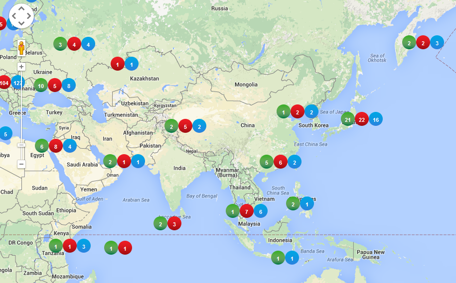

##marker-cluster-with-different-types
`<addr>`
This js function allows to add multiple categories or type which can be clustered and shown in a table on the google map.
`<addr>`
##Add the js in the script
```javascript
<script type="text/javascript" src="js/markerclusterer_category.js" ></script>

##Create the object for the clusters
```javascript
var markerCluster;

##Create the object for the styles for different categories
```javascript
var mcArray={};


##Create the category in the marker 
```javascript
 var marker = new google.maps.Marker({
            position: latLng,
            mycategory:type 
 });
 
 
##Create styles for each category
```javascript
  ////Green Style
 type='green';
 var climg=type+'-cluster';
	 
	 
 var style=[{url: 'images/'+climg+'.png',height: 28,width: 28,textColor:'#FFFFFF'},
							   {url: 'images/'+climg+'1.png',height: 28,width: 28,textColor:'#FFFFFF'},
							   {url: 'images/'+climg+'2.png',height: 28,width: 28,textColor:'#FFFFFF'}];    
						mcArray[type]={styles :style};
						
 ////Green Style
	 
	 
##Create and draw the clusters
 var mcOptions={gridSize: 80, maxZoom: maxzoom,zoomOnClick :false,minimumClusterSize:1};
markerCluster = new MarkerClusterer(map, pointers,mcOptions,mcArray); 

##Screenshot

